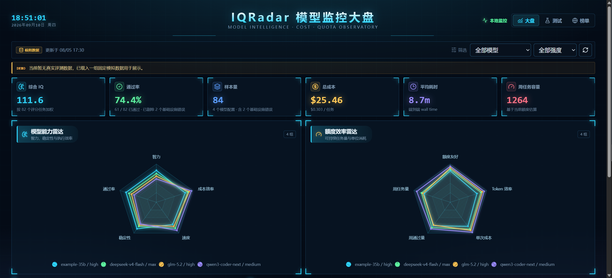
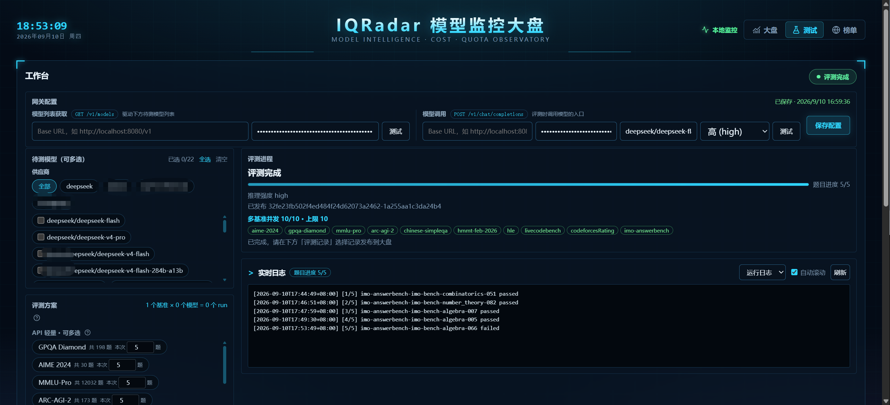

# IQRadar

本地优先的大模型评测与观测工作台。
对接任意 OpenAI 兼容网关，跑 coding-agent 与 API 基准，在本地仪表盘观察 IQ / 速度 / 成本 / 额度。

[English](README.md) | 中文

| 大盘页 | 测试页 |
|---|---|
|  |  |

**基准**：DeepSWE · Terminal-Bench 2 · 10 项 API 评测（GPQA-Diamond、AIME 2024、MMLU-Pro、ARC-AGI-2、HLE、LiveCodeBench 等），在 `configs/benchmark.yaml` 增删。

## 快速开始

需要 Linux/WSL2、Python 3.12+（[uv](https://docs.astral.sh/uv/)）、Node 20+、Docker、OpenAI 兼容网关。

```bash
cp .env.example .env            # 网关地址 / 模型 / key
cp configs/prices.example.yaml configs/prices.yaml
./start.sh                      # http://127.0.0.1:8080
```

网关占了 8080？`IQ_RADAR_PORT=8081 ./start.sh`

## 使用

1. 测试页选模型 / 样本数 / 种子，提交运行，看实时日志。
2. 勾选已完成的运行 → **发布** → 合并进不可变大盘快照（可回撤）。
3. 指标：`IQ = 通过率 × 1.5`、Wilson 95% 置信区间、成本与周额度（按 `configs/prices.yaml`）。

网关热切换：测试页直接填 baseURL + key，无需重启。

## 注意

- 仅绑定回环地址，无鉴权，勿暴露公网。
- 基准检出放 `checkouts/`（见 `configs/benchmark.yaml`）。
- 更多文档见 `docs/`。

## 许可

[MIT](LICENSE)
